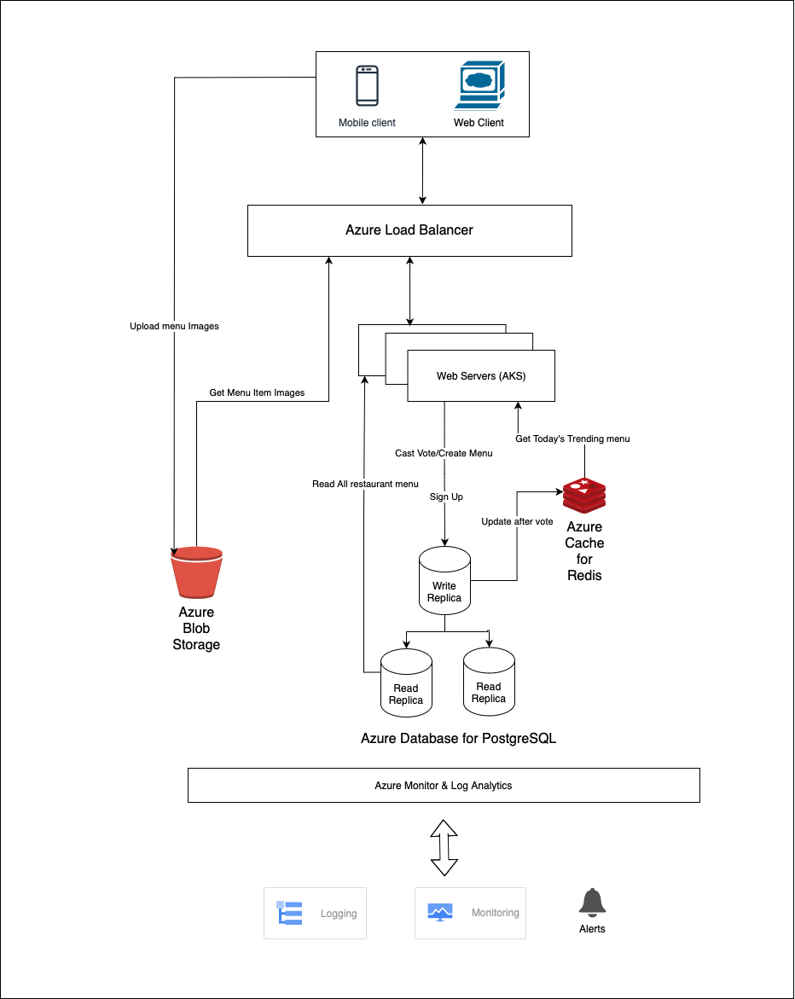

# Food Tales

Food Tales is an internal service designed to help employees decide on a lunch place. This backend service supports various features for restaurants to upload menus and employees to vote on their preferred lunch options.

## System Overview

- Restaurants can upload their daily menus via API.
- Employees can vote on menus using a mobile app.
- The backend supports both old and new versions of the app (app version is sent in request headers).

## Key Features

1. **Authentication**: Secure user authentication system.
2. **Restaurant Management**: 
   - Create restaurant profiles
   - Upload daily menus for restaurants
3. **Employee Interaction**:
   - Create employee profiles
   - View current day's menus
   - Vote for restaurant menus
     - Old API: Single menu vote
     - New API: Vote for top three menus with points (1 to 3)
   - View voting results for the current day

## Technical Stack

- **Backend**: Python with Django Rest Framework
- **Database**: PostgreSQL
- **Deployment**: Docker, Docker Compose
- **Documentation**: Postman (Swagger/OpenAPI also included for devs)
- **Testing**: Unit tests implemented

## API Endpoints

- `/auth/token/`: Obtain authentication token
- `/auth/token/refresh/`: Refresh authentication token
- `/v1/restaurant/`: Restaurant-related endpoints
- `/v1/employee/`: Employee-related endpoints

For detailed API documentation, visit:

- Visit [Postman Docs](https://documenter.getpostman.com/view/3203543/2sAXqmCmCF)

To run the API locally, follow the steps below:
- In the above postman, click on the "Run in Postman" button.
- In postman app, click on the "Environments" tab (top right corner).
- Select the "FoodTales" environment.
- Set the value of `Restaurant Auth Token` and `Employee Auth Token` in Foodtales environment displayed on the left side menu which is used to authenticate the requests and associate the requests to the restaurant and employee respectively.
- Example payloads for the requests are also provided.


System Generated Documentation
- Swagger UI: `/docs/`
- ReDoc: `/redoc/`

## Setup and Installation

1. Clone the repository:
   ```bash
   git clone https://github.com/your-repo/food-tales.git
   ```

2. Navigate to the project directory:
    ```bash
    cd food-tales
    ```

3. Build the Docker containers:
    ```bash
    docker-compose up --build
    ```
4. Run migrations:
    ```bash
    docker-compose run web python manage.py migrate
    ```
## Testing

To run the tests, use the following command:

```bash
docker-compose run web python manage.py test restaurant employee user
```

## Logging

Implemented logging using `logging` library that logs to console and file `logs/foodtales.log`.

## Linting

The files are linted using `black` and `flake8`.

## Architecture Diagram



